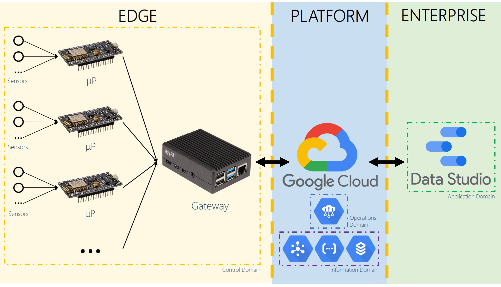

# Program for IoT-based Indoor Environment Monitoring System using Google Cloud Platform

This repository contains codes written in Python for IoT monitoring system prototype using Google Cloud Platform (GCP). The use case of this project is Indoor Environmental Quality (IEQ) monitoring system. The architecture of the system can be seen in the figure below

As you can see, the system consists of several edge microprocessors that collect environment data from sensors connected to it. The microprocessors then send the collected data to a local gateway via local network. After the data received by gateway, the gateway sends it to GCP to be stored. In the design, I use GCP IoT Core for device management and authentication, which uses GCP Pub/Sub as the cloud MQTT Broker. The data, which are received by Pub/Sub, are then taken by GCP Cloud Function that will preprocess the data and insert it to a database in GCP Cloud SQL. Details of the program can be seen inside ‘Test1’ folder.

Note that the codes provided here are for protoyping only.

Cheers,
Mukhlas Adib Rasyidy
